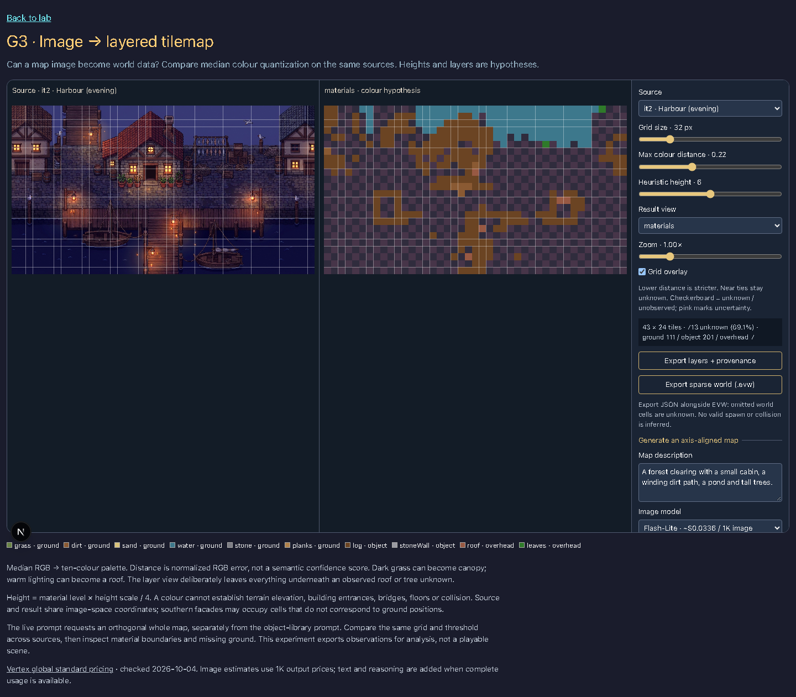
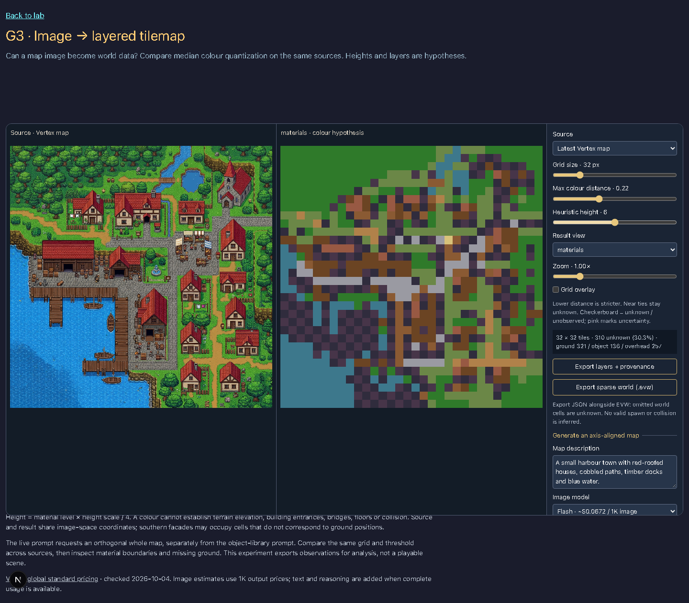
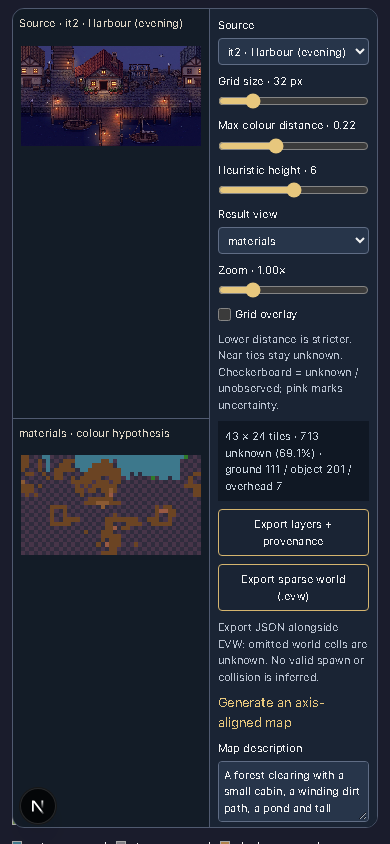

# G3: image → layered tilemap

Bead: `evermore-1fo.9`. Route: `/lab/g3-map`, with `?source=harbour` for the second offline sample.

The lab compares the it2 evening cabin and harbour with whole-map images generated through Vertex AI. It deliberately uses a separate map prompt rather than the object-library prompt: orthogonal, axis-aligned SNES-inspired pixel art, north up, square scale, terrain, paths, water, canopies and roofs. The renderer and controls run in the browser; ADC credentials remain on the server.

## Conversion and limits

Each tile uses the per-channel median of its visible pixels, then the nearest of ten fixed RGB material colours. The normalized distance threshold defaults to 0.22; a nearest/second-nearest distance margin below 0.025 stays unknown at every threshold. Predominantly transparent tiles also stay unknown. This is a colour heuristic, not semantic confidence. Partial edge tiles are included.

Accepted surfaces populate one of ground, object or overhead. Layers underneath roofs and canopies remain null. Height is a material heuristic (level 0–4 × the selected height scale / 4), not measured elevation. Height scale zero collapses all accepted surfaces to z=0. Grid size (8–128px), colour distance (0–0.6), height scale (0–12), layer view, grid overlay and zoom (0.5–3×) update immediately.

JSON exports include source/model provenance, settings, palette, material raster, height raster, each layer, candidate colours and ambiguity distances. EVW exports accepted cells using `packages/world`. **Keep the JSON sidecar with EVW:** the world format represents omitted cells as air, whereas this experiment interprets them as unknown. The placeholder spawn is not validated. Do not feed this export into gameplay without reconstruction and validation.

The sparse observations do not recover interiors, hidden ground, object footprints, roof/floor relationships, bridges, stairs, collision, reachability or ground registration. Southern facades occupy image pixels rather than ground coordinates. A low unknown fraction measures palette compatibility, not correctness.

## Live access and budget

Start the local development app and open the loopback URL. Live generation requires same-origin loopback requests and is disabled in production. Run `gcloud auth application-default login` if ADC is unavailable; the default project is `maw-evermore` (`GOOGLE_CLOUD_PROJECT` can override it). Pro, Flash and Flash-Lite are allowlisted; Flash-Lite is the default. Credentials, provider internals and raw errors are not returned to the browser. HTTP/model-access, credential, decoding and timeout errors are visible; there is no hidden model fallback.

One server process shares a rolling one-hour limit of 20 calls and $1 estimated reservations. Reservations are made before authentication, include an input allowance and the 4096-token output ceiling at the model's highest output rate, and remain after failed requests. Concurrent identical requests share one call; identical successful settings reuse an eight-image cache with $0 new cost. The state survives dev module reloads but resets with the process. This is an estimate-based local guard, not a cloud billing cap or a multi-process quota. Input bodies and decoded images are bounded; images must be at most 2048 × 2048.

The UI shows request duration, original generation duration, estimated cost, budget and cache status. [Google's global standard pricing](https://cloud.google.com/gemini-enterprise-agent-platform/generative-ai/pricing), checked 2026-10-04, supplies the 1K image estimates ($0.0336 Lite / $0.0672 Flash / $0.1344 Pro). Complete usage adds input, text and reasoning costs; incomplete usage is explicitly labelled **image only**, which excludes those token charges. Costs are not invoices.

## Evidence

[Raw measurements](comparison/measurements.json), original live PNGs, generation metadata, JSON observations, EVW exports and headless screenshots are in `comparison/`. All samples use 32px cells, distance 0.22 and height scale 6. Offline sources are 1376 × 768 (43 × 24 tiles); live images are 1024 × 1024 (32 × 32 tiles). The harbour live description and seed 1 were held constant across the three models.

| Source | Unknown tiles | Generation duration | Estimated cost |
|---|---:|---:|---:|
| it2 cabin, evening | 20.9% | Offline | — |
| it2 harbour, evening | 69.1% | Offline | — |
| Live cabin, Flash-Lite | 73.3% | 7.71s | $0.0336, image only |
| Live harbour, Flash-Lite | 37.7% | 3.29s | $0.0336, image only |
| Live harbour, Flash | 30.3% | 12.33s | $0.0672, image only |
| Live harbour, Pro | 21.8% | 21.79s | $0.138546, usage estimate |

These are single successful requests, not a latency/quality benchmark. Four requests reserved $0.98604; reusing the Pro settings returned a cache hit with $0 new cost. The lower unknown proportion in the Pro harbour does not establish greater semantic accuracy. Visually, all three harbour maps retain southern facades; Pro also includes diagonal buildings and a painted grid. The common prompt improves image-space alignment but does not enforce a recoverable tile topology. The live cabin is particularly poorly matched to this palette.







Look for roofs becoming dirt, painted lighting changing material labels, and the unknown ground underneath canopies. The evening harbour's large unknown fraction demonstrates lighting sensitivity. None of the screenshots establishes usable collision or layered geometry.

**Recommendation:** use generated maps as visual references, and prefer semantic/procedural world structure with reusable image assets for now. Fixed-palette colour quantization is useful as a diagnostic baseline but is insufficient for playable layered worlds. A future Vision segmentation comparison could identify semantic surfaces; it would still need annotated references, footprint registration, covered-layer reconstruction and gameplay validation. This experiment makes no project-wide architecture decision.

## Reproduce

Run the local app first, then:

```bash
node scripts/check-g3-map.mjs http://127.0.0.1:<BASE_PORT>
pnpm screenshot /lab/g3-map --out docs/lab/screenshots/g3-map-cabin.png
```

The headless check downloads both export formats, compares changed canvas pixels, checks grid and uncertainty extremes, heights 0/12, zoom 0.5/3, source switching, mobile/page scrolling, no horizontal page overflow and visible provider failures. Error screenshots are explicitly simulated and do not claim a real provider outage. Add `--live` to make the four bounded calls above; no live requests are made by the default check. Existing live measurements are retained during offline checks.

The 40 new unit/API tests cover unknown-layer preservation, median sampling, partial tiles, EVW round-trip, validation and bounds, production/origin protection, input streaming limits, server-only ADC, deadlines, sanitized errors, cost basis, concurrent deduplication, cache eviction and pre-auth dollar reservations/429 responses.
