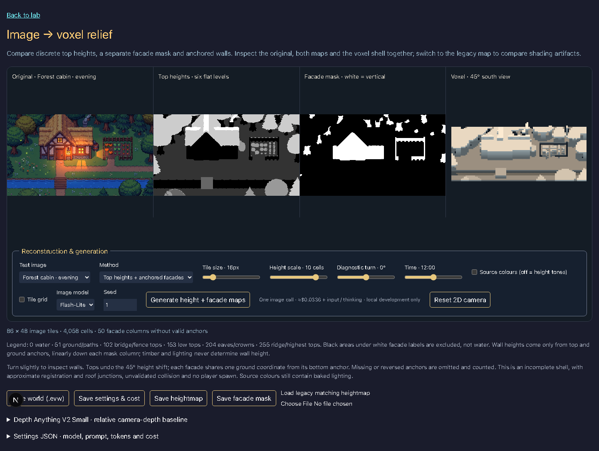
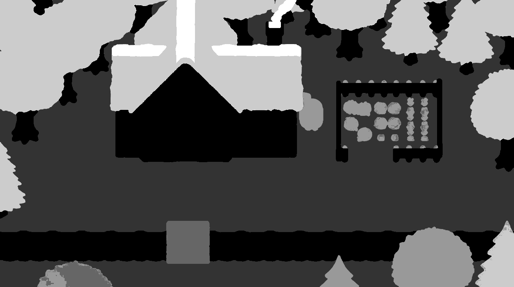
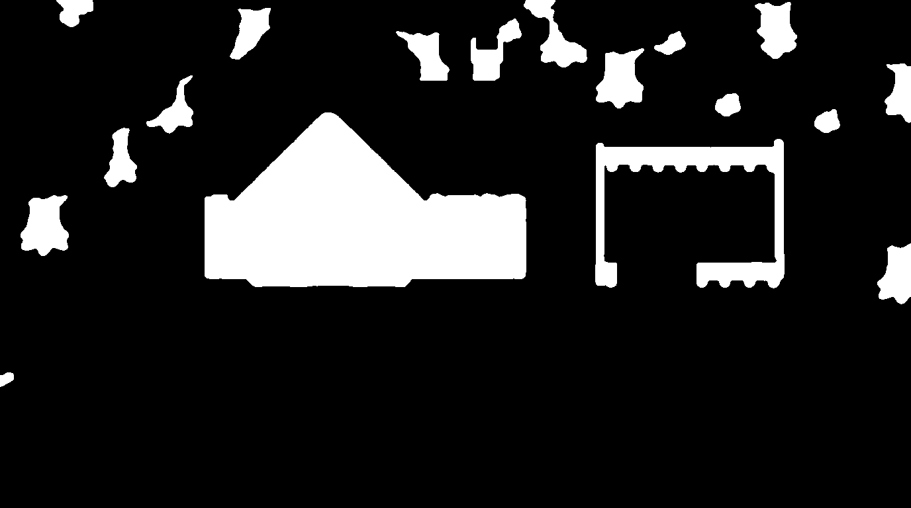
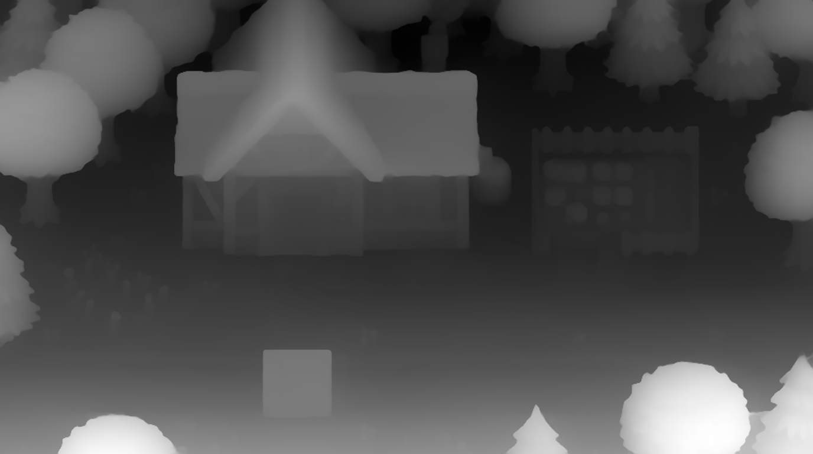
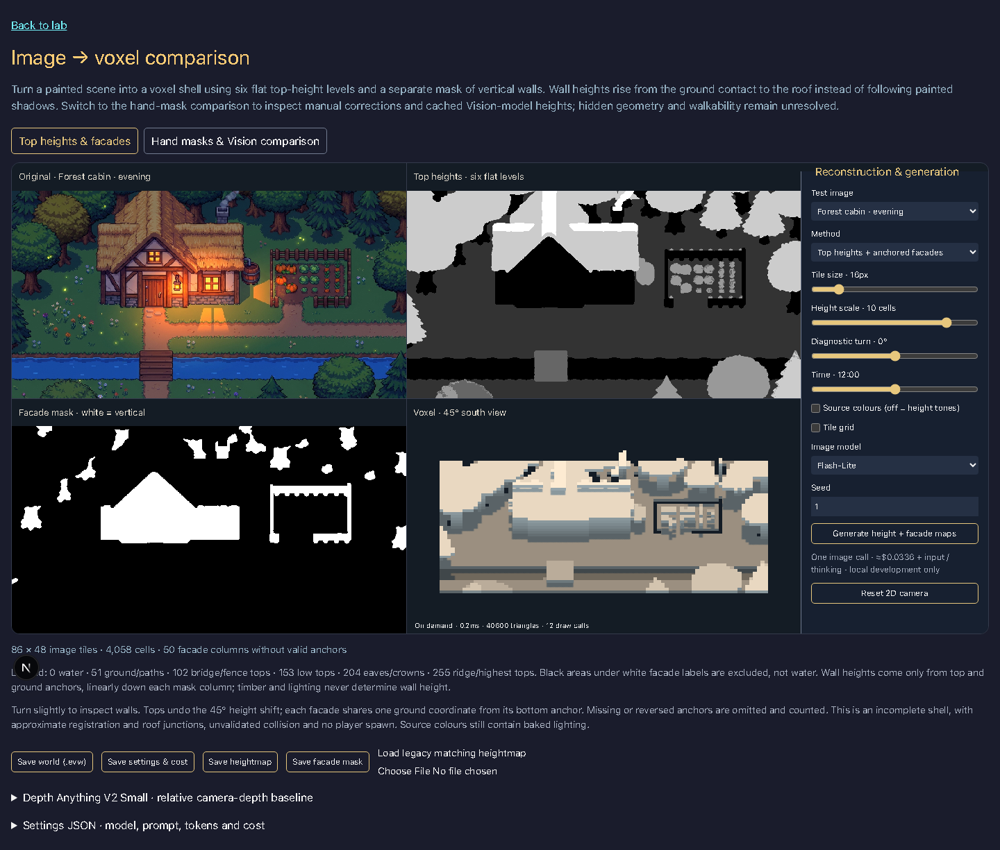
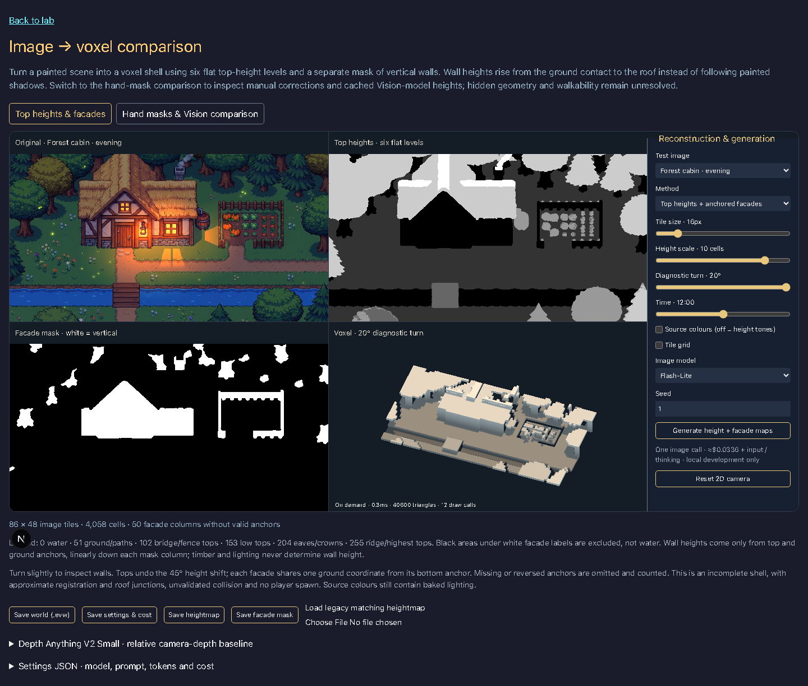

# Heightmap iteration 3: top labels and anchored facades

Bead: `evermore-1fo.17.3`. Cabin source: [original](../../../../art/moodboards/02-eigene-welt/it2-waldhuette-abend.jpg), 1376 × 768. Reproduce the saved comparison at `/lab/image-to-voxel` (16 px tiles, height scale 10, fixed 45° south camera, height tones).



## Method and observed result

One image-to-image request produces six discrete top-height labels plus a magenta sentinel for vertical surfaces. The prompt specifies an explicit RGB legend and a concrete example: plaster, dark timber and bright windows on one wall are all magenta; ground shadows share one ground code; roofs use broad steps, not shingles. The separate binary facade mask is extracted from those same magenta pixels. Both maps therefore share registration and no wall brightness is consumed as a height.





The cabin's timber, window light and plaster no longer appear in the heightmap. Paths and ground lighting collapse to one flat level. The roof retains broad geometry steps instead of shingles. Small vegetable/canopy regions still have some label noise; quantization alone is not semantic cleanup. The model is not a verified segmentation system.

In the voxel converter, a vertical mask run reads the top level immediately above and the ground level immediately below. Its sampled heights interpolate linearly between those anchors. All wall cells share the bottom ground coordinate, rather than extruding each image row as terrain. At 45°, top coordinates undo the height shift (`groundRow = screenRow + height`). The observed roof/wall junction is connected at eave height. In the saved cabin there are 4,058 occupied cells and 50 facade columns with absent or reversed anchors; those are omitted and reported. Unit tests verify the ground-to-eave wall column, interpolation, shade invariance and omitted invalid runs.

This is still an incomplete shell. Arbitrary height scale does not calibrate the drawing's projection; roof junctions can stretch, narrow masks can disappear at coarse tile sizes and adjoining objects can confuse anchors. Hidden sides, interiors, bridges with multiple layers and walkability are unvalidated. Source colours contain baked illumination; the default height tones make geometry easier to inspect. A diagnostic turn and time-of-day control expose the geometry and its shadows.

## Comparison, latency and cost

| Run | Observed result | Duration | Estimated API cost |
|---|---|---:|---:|
| Flash-Lite, independent height and facade requests, seed 1 | Height labels useful; separate mask wrongly includes the roof, stream and vegetables. Rejected as the geometry input. | 18.895 s for two requests | $0.067878 |
| Flash-Lite, shared label image, seed 1 | Facade extracted from magenta; accepted for this prototype | 3.759 s | $0.03395775 |
| Depth Anything V2 Small, CPU | Relative camera proximity; broad near/far variation and detail, no semantic top/facade labels | 8.425 s including model initialization/download | $0 API fee; local compute excluded |

Total recorded image API estimate for this iteration: **$0.10183575**. These are token-based estimates, not invoices or a repeatability benchmark. The fast second call may benefit from provider warm state; no latency guarantee is inferred. Flash-Lite uses 1,431 input tokens and 1,120 image output tokens in the accepted run. Costs use the [global standard model prices](https://cloud.google.com/gemini-enterprise-agent-platform/generative-ai/pricing): $0.25/M input tokens and $30/M image-output tokens (1K image ≈ $0.0336), plus any text/thinking output. The UI offers Flash-Lite (default), Flash and Pro, reports usage/cost and can save maps plus settings.



Depth Anything is a useful comparison for edges and near/far ordering, but its map varies with camera distance rather than world elevation. It cannot be used directly as a world heightmap; see the [official Transformers integration](https://huggingface.co/docs/transformers/model_doc/depth_anything_v2). The baseline is displayed separately in the lab and is never fed into facade reconstruction. No accuracy ranking is claimed from this single scene.

## Reproduction and artifacts

- [Accepted raw labels](raw-height.png), [prompt, tokens and cost](run.json), [depth metadata](depth-run.json).
- [Rejected independent-mask raw height](independent-mask-attempt/raw-height.png), [raw mask](independent-mask-attempt/raw-facade.png), [metadata](independent-mask-attempt/run.json). Retained so the change in approach is reviewable.
- Generate labels explicitly with local ADC: `node apps/www/scripts/generate-heightmaps.mjs [model-id]`. This spends one image call and replaces the saved cabin artifacts. It is never called by a render loop.
- Depth baseline: install `torch`, `transformers>=4.45,<5` and `pillow` in a virtual environment, then run `python apps/www/scripts/depth-baseline.py`. It downloads the Small checkpoint and uses CPU; no app runtime dependency was added.
- Screenshot: `pnpm screenshot /lab/image-to-voxel --wait 2000 --out docs/lab/screenshots/image-to-voxel-iteration-3.png`.
- Live generation is restricted to same-origin local development, allowlisted sample sources and models, six attempts per hour, three cached map pairs and deduplicated in-flight requests. No silent model fallback. Cached hits disclose that their displayed cost belongs to the original call.

The shared voxel viewer (`evermore-1fo.27`) is not present on this base branch; this experiment continues using its existing R1 preview. Optional separate ground-anchor maps remain a later comparison; the current anchors come from the facade boundary and adjacent ground labels.

## Recovery on the current base

The lab now preserves both experiments: **Top heights & facades** is the default; **Hand masks & Vision comparison** remains directly reproducible at `?experiment=comparison`. Both share the R1 preview and keep their controls beside the rendered result. The harbour can use its saved grayscale map or the colour heuristic; it has no saved iteration-3 facade pair.





The saved-map headless check verifies nonempty geometry, rendered pixel and settings changes, height scales 0/12, grids 8/64, lighting, scene and experiment switching, world/map/settings downloads, and mobile scroll at 390 × 844. The comparison check passes all 18 source/method/geometry combinations, patch edits and correction timing, exports, pixel changes, extremes and mobile layout. Screenshots were inspected; controls and canvas occupy separate columns without horizontal overflow. The [facade proof](recovery/facade-proof.json) records the viewport bounds and zero model requests; [comparison measurements](recovery/comparison/measurements.json) retain the comparison results. Automated correction timings are interaction smoke evidence, not human editing times.

Additional model cost for recovery: **$0**. Existing masks and model outputs are reused. The original total estimate of $0.10183575 is unchanged. The 50 unresolved facade columns remain explicitly omitted; this recovery does not establish collision or walkability.

Reproduce with the worktree's development server running:

```sh
node scripts/check-image-to-voxel-facades.mjs
IMAGE_TO_VOXEL_PROOF_DIR=docs/lab/experiments/heightmap-test/iteration-3/recovery/comparison/ node scripts/check-image-to-voxel.mjs
```

The checks use `localhost`, matching Next.js's development-origin guard. Proof files are written separately so the original comparison evidence remains intact.
