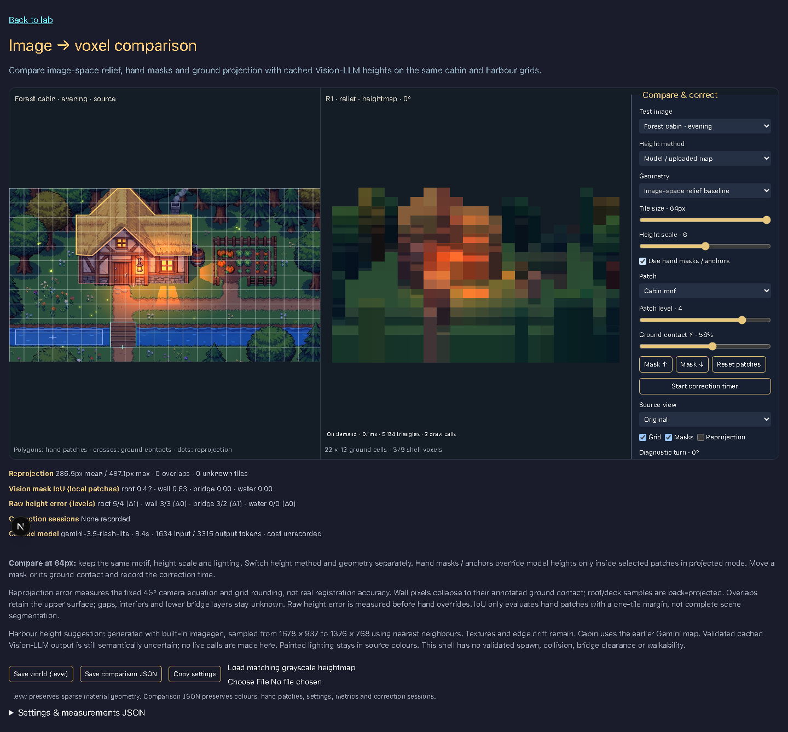
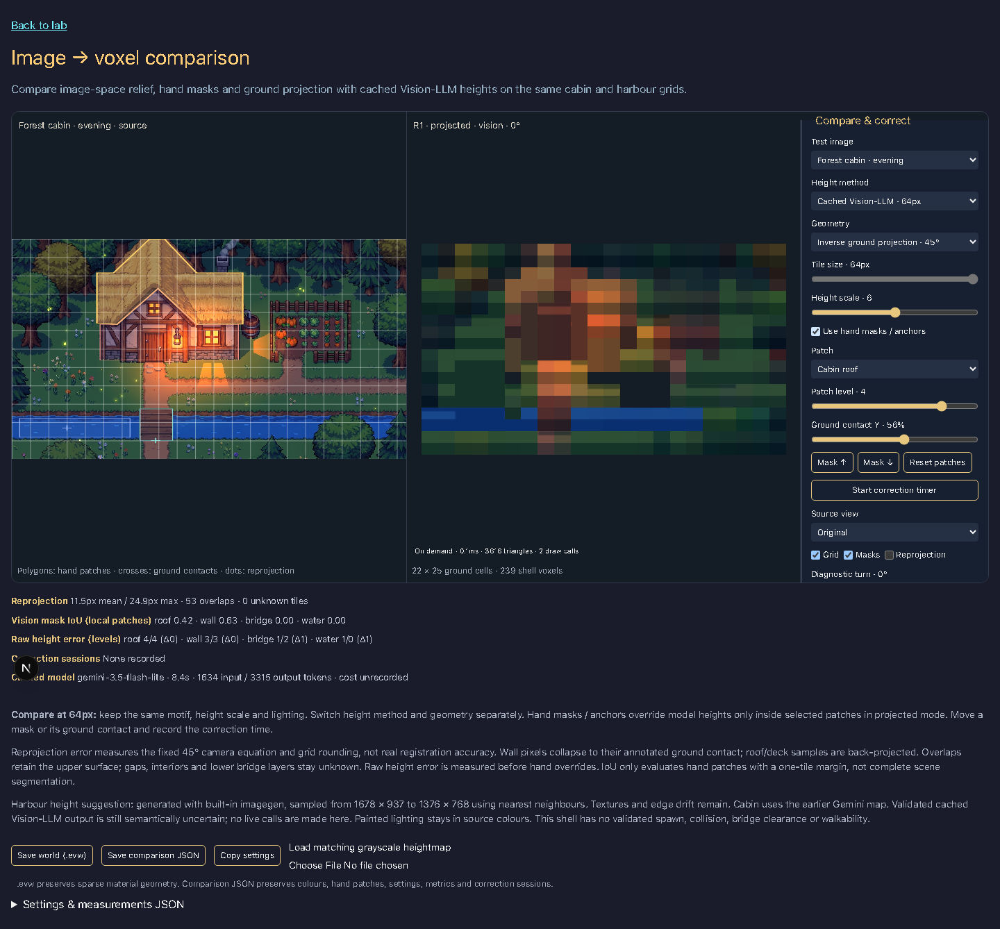
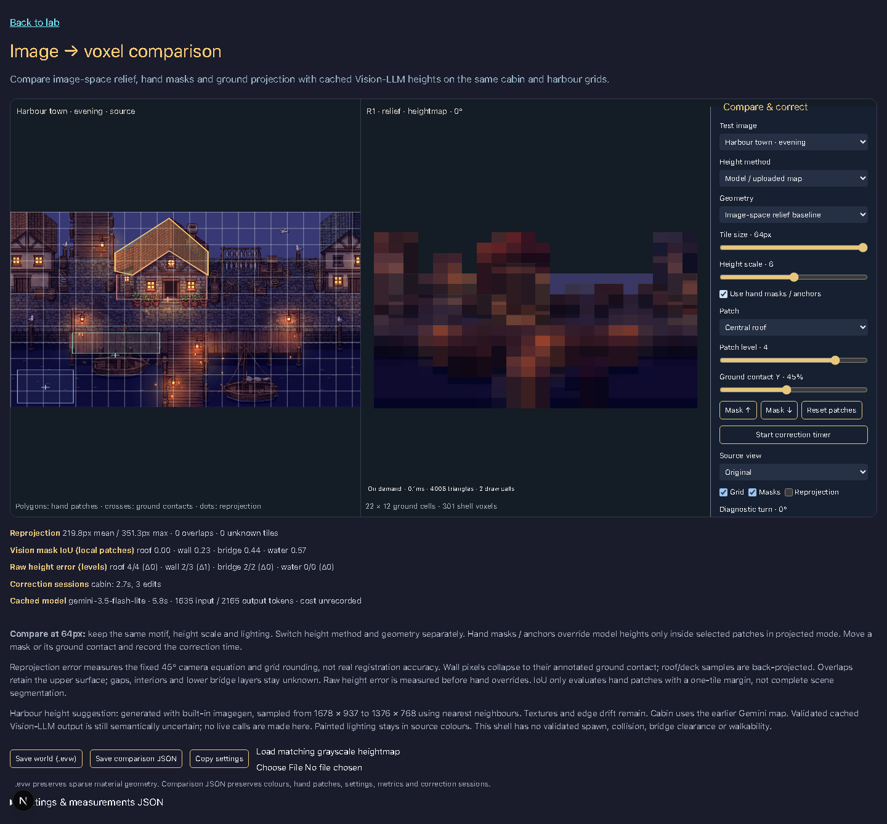
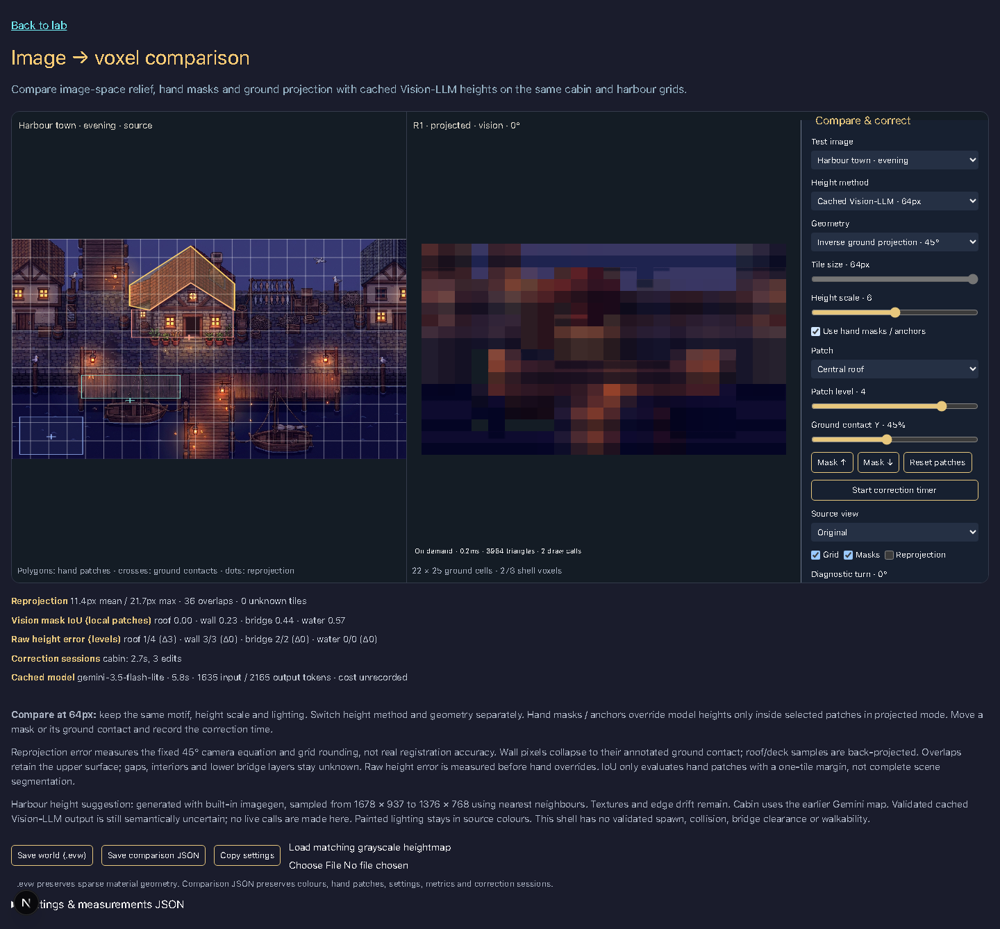

# Image → voxel comparison

Beads: baseline `evermore-1fo.17.2`, comparison `evermore-8zgu`. Route: `/lab/image-to-voxel` (harbour: `?source=harbour`).

Compare the same cabin and harbour images using colour heuristics, model-drawn grayscale maps and validated cached Vision-LLM tiles. Choose the height method independently from image-space relief or inverse ground projection. The comparison starts on a 64px grid: both 1376 × 768 sources have 22 columns × 12 rows (the final column is partial), height scale 6, a 45° inclination, zero rotation and noon lighting.

The result is an **observed surface shell**. Unknown interiors, backs, gaps and lower bridge layers are not reconstructed. Neither view establishes collision, spawn, clearance or walkability. The R1 mesher, material palette, daylight and orthographic camera are reused; no provider or world-format decision is made.

## Controls and exports

The source, R1 result and scrollable controls remain visible together, including on mobile. Hand patches cover one roof, facade, bridge/dock and water area per scene. They are local reference annotations, not exhaustive ground truth. Select a patch, change its height level or ground-contact Y, and move its mask vertically. Hand overrides affect only projected geometry; turning them off preserves the raw model proposal. Facade pixels collapse onto their ground contact, with a height derived from distance above that contact and capped by the patch height. Roof and deck samples are back-projected; overlaps keep the upper surface and report collisions. Known facade observations are retained at their sampled heights.

At zero height scale the shell is flat. Diagnostic turn (±20°) exposes missing geometry; reset returns to the fixed camera. Changing daylight adds new shadows while the source's painted lighting stays baked in. The renderer runs on demand and reports CPU render-call time, triangles and draw calls, rather than claiming continuously measured FPS.

Start and stop a correction session explicitly. The timer records elapsed milliseconds, annotation edit count, starting/ending settings and corrected patches; source switching is disabled while recording. This is an instrumentation tool, not an automatic quality score.

- **Save world (.evw)** serializes the sparse material shell using `packages/world`; RGB colours are in the companion JSON.
- **Save comparison JSON** includes source, settings, camera, annotations, raw metrics, model provenance, correction sessions, projected tiles and samples.
- **Copy settings** copies annotations and measurements too; the selectable JSON textarea is the clipboard fallback.
- **Load matching grayscale heightmap** accepts a local PNG without upload. Dimensions must match the source; this does not prove registration.

## Model evidence and validation

Cabin retains the earlier [Gemini heightmap](../heightmap-test/README.md). The new harbour map was generated with built-in imagegen from the harbour source. Its [provenance](../../../../apps/www/public/image-to-voxel/harbour-height.provenance.json) records the prompt, source hash and native 1678 × 937 dimensions. The browser samples it at 1376 × 768 with nearest neighbours. Texture remains and silhouette drift is unmeasured; the resize is normalization, not registration.

The two successful cached Vision responses were generated through Vertex AI using `gemini-3.5-flash-lite`. Offline regeneration is explicit:

```bash
cd apps/www
node --experimental-strip-types scripts/generate-image-voxel-vision.mjs cabin
node --experimental-strip-types scripts/generate-image-voxel-vision.mjs harbour
```

The script requires configured application-default credentials. It asks for 12 ordered rows of 22 `{level, region}` tiles, then converts them to coordinates. An earlier cabin coordinate-output attempt produced duplicate tiles and was rejected; that response and an earlier harbour coordinate-output proposal are retained in `comparison/`. The comparison uses the selected ordered-row response for each source. The generator and browser both validate source identity, dimensions, grid size, exact coverage, duplicates, integer coordinates and levels, allowed region names, zero-height water and raised decks. Valid JSON still does not prove semantic accuracy: roof-over-wall relationships, continuous paths and real object ground footprints remain unverified.

Each cache records source SHA-256, model, prompt, latency and token usage. Cabin: 8.35s, 1,634 input / 3,315 output tokens. Harbour: 5.84s, 1,635 input / 2,165 output tokens. Cost was not recorded; no estimated charge is presented as an invoice. There are no live model calls in the browser and no repeatability benchmark from one selected response per source.

## Measurements

[Raw measurements](comparison/measurements.json) contain all 18 combinations: two scenes × three height methods × relief / projected / projected with hand overrides. Raw anchor errors use four manually chosen probes per image and levels roof 4, wall 3, bridge 2, water 0. They are measured **before** hand overrides, so applying a correction does not hide the original model error.

| Scene | Method | Raw errors: roof / wall / deck / water | Relief reprojection mean | Projected overlaps (without hand overrides) |
|---|---|---|---:|---:|
| Cabin | Heuristic | 0 / 1 / 2 / 0 | 228.2px | 42 |
| Cabin | Grayscale map | 1 / 0 / 1 / 0 | 286.5px | 52 |
| Cabin | Vision | 0 / 0 / 1 / 1 | 254.2px | 51 |
| Harbour | Heuristic | 0 / 1 / 1 / 0 | 203.5px | 27 |
| Harbour | Grayscale map | 0 / 1 / 0 / 0 | 219.8px | 39 |
| Harbour | Vision | 3 / 0 / 0 / 0 | 247.2px | 31 |

Without hand overrides, inverse projection gives 11.4px mean / 21.7px max equation residual in all six runs, within the 64 × cos(45°) / 2 ≈ 22.6px quantization bound. This measures the chosen camera equation and rounding, **not recovered ground accuracy**. Good reprojection alone cannot select the right height: different heights can move to different ground rows and produce the same screen position. Edited contacts and facade height caps may increase the residual; collisions also show that some observations cannot coexist in a single-height grid.

Vision mask IoU compares tile-centre labels against each hand patch inside its bounding box plus a one-tile margin. Unannotated objects outside that window are excluded. These same cached mask scores appear for every height method:

| Scene | Roof | Wall | Bridge/dock | Water |
|---|---:|---:|---:|---:|
| Cabin | 0.425 | 0.625 | 0.000 | 0.000 |
| Harbour | 0.000 | 0.227 | 0.444 | 0.571 |

Vision finds some cabin roof/facade structure but misses the small bridge and chosen water patch. In the harbour it misses the selected roof entirely. The grayscale harbour suggestion matches three of four raw probes; that small sample is insufficient to rank whole-scene geometry. Hand anchors are a useful correction surface, not evidence of automatic reconstruction.

`*-correction-smoke.json` records three automated edits per scene and measured elapsed time. These short durations validate the timer and export only; **human correction time has not been measured**. A meaningful editing benchmark still needs a person, a defined target, a finish criterion and repeated runs.

## Visual evidence and verification









Look at the selected roof, the facade's collapse towards its ground contact, and holes/overlaps around water and decks. Projection changes the silhouette but cannot fill unseen layers. The coarse 64px comparison intentionally loses small features; the 8px extreme is available for grayscale/heuristic exploration, while cached Vision stays at its original 64px grid.

Start the local app, then run `node scripts/check-image-to-voxel.mjs`. The headless check measures all combinations, edits height/contact/mask with a timed session, downloads both formats, verifies changed canvas pixels after rotation, resets the camera, checks height scales 0/12 and tile sizes 8/64, and checks mobile scrolling without control/canvas overlap or horizontal overflow. Screenshots also include the harbour grayscale map, Vision tiles and mobile scroll state. Projection/validation unit tests cover malformed responses, real caches, raw levels at zero scale, rounding, contact changes, wall correction and unknown preservation. Formula checks cover install, typecheck, lint, build and the full test suite.
