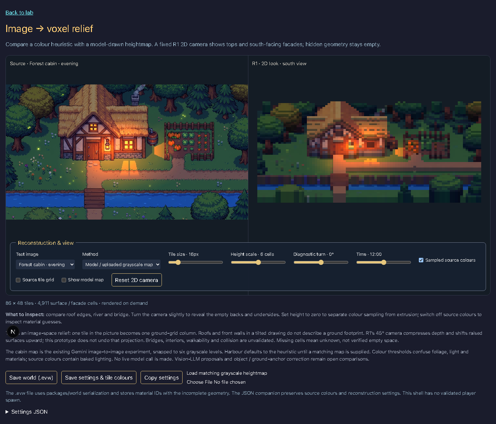
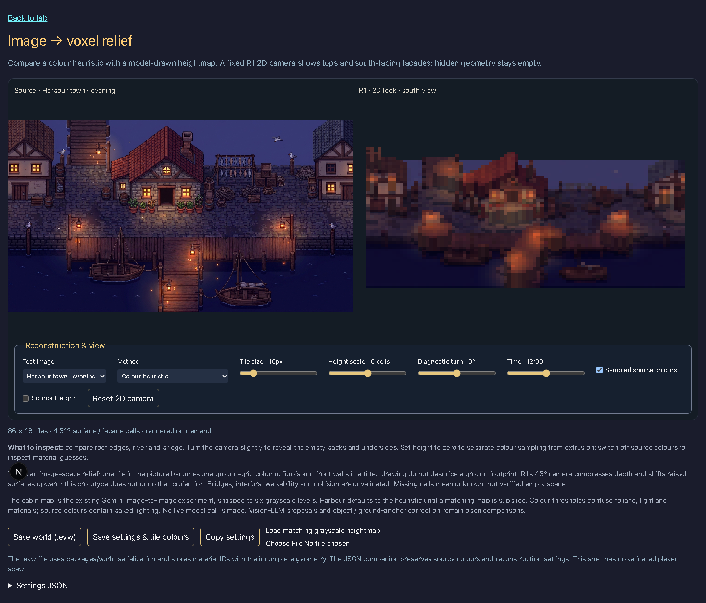

# Image → voxel relief prototype

Bead: `evermore-1fo.17.2`. Route: `/lab/image-to-voxel` (harbour: `?source=harbour`).

The browser samples the two iteration-2 moodboards at an adjustable tile size. Each tile stores a median RGB colour, a guessed material and a quantized height. The cabin can use the existing [model-drawn heightmap](../heightmap-test/README.md); both images support a deterministic colour heuristic. A matching grayscale PNG can be loaded locally, without upload or model calls. Heightmaps must have the same dimensions as the source; this validates dimensions, not image registration.

The R1 chunk mesher, orthographic camera and daylight functions render the result. The default camera is 45° inclination and 0° rotation. A ±20° diagnostic turn exposes the shell trick. Only top cells and south-facing facade cells above the next row are populated. Hidden column interiors, backs and side walls remain air; they are unknown, not reconstructed empty space. The renderer can switch between sampled source colours and the existing world material palette.

## Evidence

Look at the roof silhouette, river and bridge. At zero height scale all tiles sit at one cell; increasing height exposes facades and shadow differences. Changing the light moves the new shadows, while painted window glow and original shadows remain baked into the sampled colours. Colour heuristics confuse green trees with grass and warm light with wood/roof.

## Export

- **Save world (.evw)** uses `serializeWorld` from `packages/world`. The existing world schema stores material IDs, not per-cell RGB colours. It preserves the sparse surface/facade shell.
- **Save settings & tile colours** exports the JSON companion: source, method, camera, height scale, dimensions and each tile's colour/material/height. Uploaded map files must be retained separately.
- **Copy settings** also offers a selectable JSON textarea when clipboard permission is unavailable.

## Limits and next comparisons

This is an **image-space relief**, not a registered reconstruction of ground coordinates. An image tile is directly mapped onto the ground grid; a tilted drawing mixes visible roofs, walls and ground. R1 compresses ground depth and raises high surfaces in screen space, so source and result do not align exactly. Object masks, ground anchors and inverse projection are the next meaningful improvement, as explained in the [research](../../image-to-voxel-research.md).

The cabin is the only source with an existing model-drawn heightmap. Harbour uses the heuristic until a matching map is supplied. Vision-LLM tile proposals have not been benchmarked in this slice. Bridges, interiors, spawn, collision and walkability are unvalidated; do not use the exported shell as a playable world. Missing rear geometry also limits shadows under other light directions. No new world format, model provider or rendering architecture is selected here.
