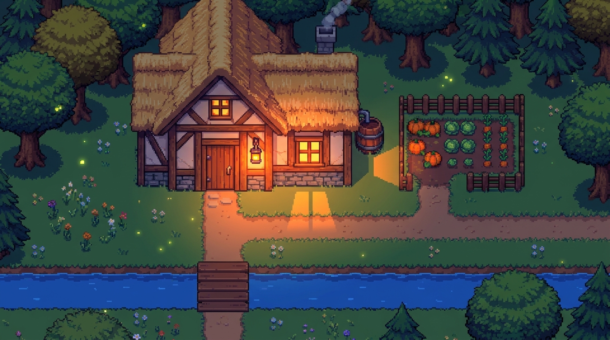
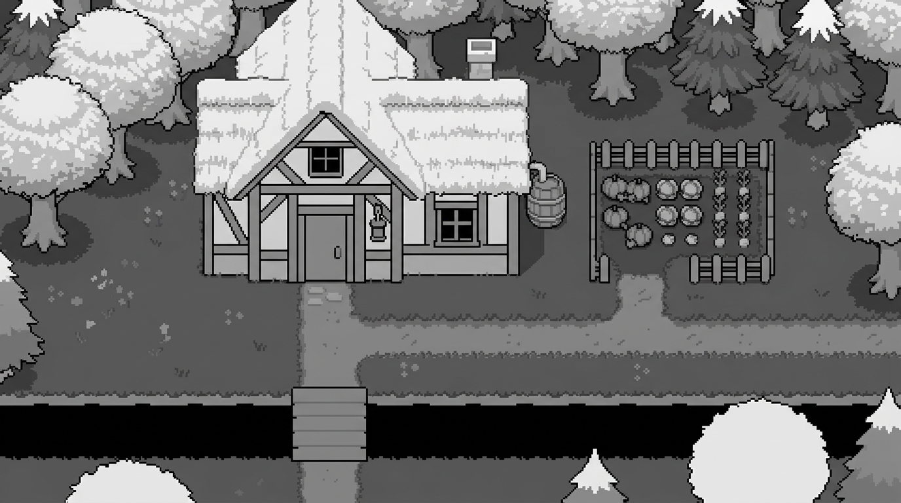

# Recherche: Bild → Höhe, Material und Voxel

Stand: 03.10.2026. Bead: `evermore-1fo.17.1`, Epic: `evermore-1fo.17`.
Analyse und Prototyp-Empfehlung; keine neue Architekturentscheidung und keine Implementierung.

**Empfehlung:** Die vorhandene Bild-zu-Bild-Höhenkarte zuerst als groben Vorschlag quantisieren und mit editierbaren Objektmasken kombinieren. Ein Vision-LLM liefert ergänzend Objektklassen, Höhenstufen und Bodenanker als strukturierte Daten. Materialien getrennt behandeln. Depth Anything V2 Small dient als günstige Vergleichsbaseline, nicht als direkte Welt-Höhenkarte. Vollständige Image-to-3D-Rekonstruktion ist für diese erste Scheibe zu aufwendig und auf einzelne Assets statt begehbare Karten ausgerichtet.

## Was wir tatsächlich rekonstruieren müssen

Die Moodboards sind keine senkrechten Luftbilder: Sie zeigen Dachflächen, Vorderwände und Baumstämme zugleich. Das Ziel ist eine achsenparallele, fest ausgerichtete RPG-Kamera mit sichtbaren Fassaden und dynamischer Beleuchtung, passend zu [ADR 0010](../adr/0010-art-direction-welt-pixel-art-ui-offen.md) und [Vision, Abschnitte 5–6](../vision.md).

**Kameratiefe ist nicht Welthöhe.** Eine Tiefenkarte ordnet sichtbare Bildpunkte entlang der Kamera an. Ein Höhenfeld ordnet dagegen jeder Bodenposition eine Höhe zu. In einer geneigten orthografischen Ansicht hängt die Bildschirm-Y-Position sowohl von Bodenentfernung als auch von Höhe ab. Selbst eine perfekte Tiefenschätzung lässt sich deshalb nicht einfach als Säulenhöhe pro Bildpixel verwenden. Kamera, Bodenebene und Skalierung müssen festgelegt und die sichtbaren Flächen auf Bodenkoordinaten zurückgeführt werden. Bei echter senkrechter Draufsicht wäre diese Beziehung einfacher, aber Fassaden wären kaum sichtbar.

Ein einzelnes Höhenfeld kann ausserdem Brücke über Wasser, Baumkrone über begehbarem Boden oder ein betretbares Haus nicht vollständig beschreiben. Für den Prototyp genügen Bodenhöhe plus benannte Objekte mit Fussabdruck, Bodenanker, Höhe und sichtbaren Oberflächen. Unbekannte Hinterseiten dürfen für die feste Ansicht vereinfacht werden. Sie sind für Schattenwurf aus anderen Lichtrichtungen und spätere Cutaways trotzdem relevant; eine fehlende Rückwand ist keine physikalisch vollständige Szene.

Das Originalbild enthält bereits Beleuchtung: gelbe Fenster, Laternenlicht auf Gras/Weg und dunkle Baumschatten. Als unveränderte Textur bleibt dieses Licht bei einem Tag/Nacht-Wechsel eingebrannt. Die Geometrie allein entfernt es nicht. Für die erste Scheibe ist das eine explizite Einschränkung; Materialfarbe/Albedo und Emission sind später separat zu prüfen.

## Evidenz und Vergleich

Die Tabelle bewertet **erwartete Eignung**, keine gemessene Rangliste. In dieser Recherche wurden keine neuen Modellaufrufe oder Benchmarks durchgeführt. Latenzklassen sind Planungsannahmen: „kurz“ = eher Sekunden, „mittel“ = mehrere bis einige zehn Sekunden, „lang“ = potenziell deutlich länger inklusive Laden/mehrerer Durchläufe. Browserhardware, Auflösung und Warmstart ändern diese Werte stark. Es gibt hier keinen belegten Pixel-Art-/RPG-Höhenbenchmark.

| Verfahren | Qualität für unseren Stil / Grenzen | Kosten | Latenz / Laufzeit | Lizenz bzw. Nutzung | Aufwand und Rolle |
|---|---|---|---|---|---|
| [Depth Anything V2 Small](https://github.com/DepthAnything/Depth-Anything-V2) | Gute Kandidatur für Kanten und relative Tiefenordnung; Pixel-Art und geneigte Draufsicht unvalidiert. Keine semantischen Höhenstufen. | Keine API-Gebühr bei Eigenbetrieb; Gerät oder GPU-Serving | Kurz, warm; Browser via ONNX/Transformers.js möglich | Small: Apache-2.0; Base/Large/Giant: CC-BY-NC-4.0 | Mittel; bevorzugte Tiefenbaseline, Small hat 24,8 Mio. Parameter |
| [MiDaS](https://github.com/isl-org/MiDaS) | Relative Tiefe; gleiche Projektionseinschränkung. Kleines Modell als CPU-/Browservergleich denkbar | Eigenbetrieb | Kurz bis mittel, modellabhängig | MIT im Repo; konkrete Artefakte mitprüfen | Mittel; ältere Baseline, Repo seit 25.08.2025 archiviert |
| [Marigold Depth v1.1](https://huggingface.co/prs-eth/marigold-depth-v1-1) | Affin-invariante Tiefe, also keine absolute Höhe. Interessanter Vergleich bei stilisierten Bildern; Nutzen bei unseren Bildern offen | Eigenbetrieb, eher GPU | Mittel; Schritte/Ensemble erhöhen Aufwand | Code Apache-2.0; Gewichte CreativeML Open RAIL++-M | Mittel bis hoch; Offlinevergleich, kein erster Browserpfad |
| [SAM 2.1](https://github.com/facebookresearch/sam2) mit Punkten/Boxen | Objektmasken; keine Materialnamen und keine Höhe. Handprompts könnten Dach, Wand und Baum trennen; Pixelkanten müssen geprüft werden | Eigenbetrieb; zusätzliche Klassifikation nötig | Encoder einmal, Decoder je Prompt; im Browser Export/Operatoren prüfen | Code und Checkpoints Apache-2.0; Demo-Abhängigkeiten separat | Mittel; interaktive Maskenkorrektur, Tiny als Startkandidat |
| [Gemini 3.8 Flash](https://ai.google.dev/gemini-api/docs/models/gemini-3.8-flash): Klassen/Objekte als JSON | Semantik und Höhenprioren; präzise Masken/Tile-Koordinaten können halluziniert werden | Tokenbasiert, Beispiel unten | Kurz bis mittel; grosse Tile-Ausgaben langsamer | Proprietärer Dienst, Cloud-Vertragsbedingungen | Niedrig bis mittel; Objektinventar plus diskrete Höhen, anschliessend validieren |
| Dasselbe Vision-LLM: Höhe direkt pro Tile | Kontrollierte Werte möglich; Dachprojektion, Fussabdruck und kleine Objekte bleiben mehrdeutig | Mehr Output-Tokens als Objektliste | Mittel bei dichtem Raster; in Teilregionen arbeiten | Wie oben | Mittel; kleine Vergleichsvariante, nicht ungeprüft für Kollision |
| [Gemini 3.1 Flash Image](https://ai.google.dev/gemini-api/docs/models/gemini-3.1-flash-image): Höhen-/Materialkarte mit Referenz | Lokaler Höhentest vielversprechend, aber Texturen statt flacher Stufen. Materialkarte noch ungetestet; zwei Karten können verschieden driften | Bildausgabe plus Input/Thinking; Beispiel unten | Mittel, keine lokale Messung | Proprietärer Dienst; unterstützt Bildbearbeitung, keine Structured Outputs | Niedrig für Vorschlag, mittel für Bereinigung; erster Prototyp-Pfad |
| [Pix2Vox](https://github.com/hzxie/Pix2Vox) | Direkte Voxel-Rekonstruktion aus Einzel-/Mehransichten; Objektbenchmarks, keine validierte RPG-Szenenübersetzung | Eigenbetrieb | GPU; für unsere Szene ungemessen | MIT-Code; Datensatz-/Gewichtsbedingungen gesondert prüfen | Hoch; Forschungsreferenz, nicht bevorzugt |
| [TripoSR](https://github.com/VAST-AI-Research/TripoSR) / [TRELLIS](https://github.com/microsoft/TRELLIS) | Vollständige 3D-Assets; kann verdeckte Geometrie erfinden und Pixel-Look verändern. Ganze Szene müsste in Assets zerlegt werden | Eigenbetrieb, GPU plus Mesh→Voxel-Nacharbeit | TripoSR publiziert <0,5 s auf A100, kein End-to-End-Versprechen; TRELLIS ≥16 GB GPU | TripoSR Code/Gewichte MIT; TRELLIS Modelle/mehrheitlich Code MIT, Ausnahmen bei Submodulen | Hoch; allenfalls isolierte Häuser/Bäume später |
| [SpriteStack](https://spritestack.io/) / [SpritePile](https://store.steampowered.com/app/1098420/SpritePile/) | Manuelle Schichten/Spritestacking bewahren Pixel-Art. Ein Sprite liefert keine fehlenden Höhenschichten automatisch | Editorlizenz bzw. manuelle Arbeitszeit; Kaufpreis nicht kalkuliert | Bearbeitungszeit dominiert | Produktbedingungen, keine angenommene Open-Source-Lizenz | Niedrig für einzelne Referenzobjekte, hoch für ganze Karten |
| Deterministische Extrusion aus Masken + vorgegebenen Höhen | Exakte, editierbare Kanten; Qualität hängt an Masken/Höhen. Helligkeitsschwellen im Original verwechseln Licht mit Höhe | Keine Modellgebühr | Kurz, Browser geeignet | Eigene Verarbeitung; Rechte der Inputs bleiben relevant | Niedrig bis mittel; notwendige Brücke von Vorschlag zu Geometrie |

SAM ist promptbare Segmentierung, kein semantischer Materialklassifikator. Ein grüner Bereich kann Gras, Blätter, Holz mit Licht oder Schatten sein. Materialklassen müssen durch Objektwissen, Handkorrektur oder ein separates Klassifikationsmodell ergänzt werden. Marigolds zusätzliche [Intrinsic-Image-Modelle](https://github.com/prs-eth/Marigold) schätzen unter anderem Albedo/Roughness/Metallicity; das ist keine Liste von Spielmaterialien wie Holz, Stein und Wasser. Der neuere [Marigold-V2-Ansatz](https://github.com/huawei-bayerlab/marigold-v2) ist ein weiterer Forschungskandidat für einstufige dichte Vorhersagen, aber keine hier validierte Pixel-Art-Lösung und nicht Teil der Startempfehlung.

## Bildmodell zeichnet seine eigene Höhen-/Materialkarte

Der bestehende [Testbericht](experiments/heightmap-test/README.md) ist die einzige lokale Modell-Evidenz. Quelle und Ergebnis wurden für diese Recherche visuell betrachtet:

Haus, Fluss und Brücke passen visuell eng zur Vorlage; gleiche Abmessungen allein beweisen keine pixelgenaue Registrierung. Dachschindeln, Fenster und Baumtexturen erscheinen weiterhin als Helligkeitsunterschiede. Die helle Vorderwand illustriert die Verwechslung zwischen sichtbarer Oberfläche und oberster Höhe eines Boden-Tiles. Das bestätigt den Testbericht, liefert aber weder eine Fehlerquote noch Wiederholbarkeit über andere Motive.

**Graustufen:** Für diesen ersten Test pragmatisch, weil das vorhandene Ergebnis nutzbar ist. Wenige feste, weit getrennte Codes vorgeben, z.B. `0, 51, 102, 153, 204, 255`, und explizit mit Höhenstufen verknüpfen. Das sind vorgeschlagene Prototypwerte, keine Projektkonvention. Modellfarben sind Vorschläge: anschliessend auf gültige Codes abbilden; nicht jede Texturschwankung zur Geländeform machen. Objektinterne Glättung statt globaler Glättung verhindert, dass Flussufer und schmale Zäune verschwinden. Dachschrägen dürfen gezielte Abstufungen haben; ein flaches Objektmittel ist nicht immer richtig.

**Feste Farbpalette:** Für Material-IDs geeigneter als Graustufen, weil Kategorien keine natürliche Reihenfolge haben. Gut unterscheidbare, explizite RGB-Codes für Wasser, Boden, Holz, Stein, Laub, Dach und `unknown` verwenden; keine ähnlichen Naturfarben. Verluste, Antialiasing und fremde Farben bleiben möglich. PNG, nächster erlaubter Farbcode mit Abstandsschwelle, unklare Pixel als `unknown` und sichtbare Korrektur sind nötig. Höhen und Materialien in getrennten Karten halten; dieselbe Helligkeit darf nicht beide Bedeutungen tragen. Eine diskrete Farbpalette könnte auch Höhen robust trennen, muss aber gegen Graustufen getestet werden.

**Deckungsgleichheit:** Referenzbild, feste Auflösung/Seitenverhältnis, keine neue Komposition und ein Änderungsauftrag ausschliesslich für Codes helfen, garantieren aber keine Registrierung. Kantenüberlagerung an Dach, Hausbasis, Brückenkanten und Flussufer messen. Bei driftenden Umrissen Masken aus dem Original verwenden und generierte Werte nur innerhalb dieser Masken aggregieren; erneutes Generieren ist kein Ersatz für diese Prüfung. Zwei separat generierte Karten jeweils gegen das Original prüfen, nicht bloss gegeneinander.

## Vision-LLM als strukturierter Vorschlag

Gemini 3.8 Flash nimmt Bilder an und liefert Text inklusive Structured Outputs; Gemini 3.1 Flash Image ist der separate Bildgenerator. [Modellkarte](https://ai.google.dev/gemini-api/docs/models/gemini-3.8-flash) und [Schema-Dokumentation](https://ai.google.dev/gemini-api/docs/structured-output) bestätigen den Pfad. Schema-konformes JSON garantiert keine richtigen Höhen oder Koordinaten.

Für eine erste Variante kleine, beschriftete Bildregionen verwenden und Objekte statt Tausender unabhängiger Zellen anfordern: `objectId`, `class`, `footprint`, `groundAnchor`, `heightLevel`, `material`, `walkable`, `unknown`. Eine direkte Tile-Variante bekommt Rasterursprung, Zellgrösse, Zeilen-/Spaltennummern, erlaubte Höhen und Material-Enums vorgegeben. Rasterzellen im **Bildraum** dabei ausdrücklich von Zellen im **Welt-Bodenraster** unterscheiden. Ein Screen-Tile mit Dach ist kein Hausgrundriss.

Empfohlene Validierung: Vollständigkeit/Bounds, gültige IDs, keine doppelten Zellen, Dach über Wand, Brückendeck über Wasser, durchgehender Weg, konservative Kollision bei `unknown`. Modellkonfidenz allein ist kein kalibrierter Fehlernachweis. Keine automatische Freigabe einer begehbaren Welt nur aufgrund gültigen JSONs.

## Browser, Vertex und Cloud Run

| Ausführungsort | Passt für | Praktische Grenze |
|---|---|---|
| Browser: normale Bild-/Rasterverarbeitung | Quantisierung, Maskeneditor, Overlay, Vorschau, gecachte Szenendaten | Schnell und günstig ohne Modelldownload; keine verdeckte Geometrie automatisch |
| Browser: ONNX/WebGPU | Optional Depth Anything Small oder exportierte SAM-Variante | Download, GPU-Speicher, Operatorabdeckung, Erstinitialisierung und mobile Geräte messen; WASM-Fallback kann langsam sein |
| Cloud Run CPU + verwaltete Gemini-Aufrufe | API-Validierung, Budgets, Cache, serverseitige Zugangsdaten | Netzwerk/Quoten/Antwortzeit; kein eigener GPU-Container für den Gemini-Aufruf nötig |
| Cloud Run GPU / eigener Vertex-Endpunkt | PyTorch-Tiefenmodelle, SAM, Asset-Rekonstruktion | Modell laden, Container, GPU-Quota/Region und laufende Instanzkosten; für ersten Versuch unnötiger Betriebsaufwand |

[ONNX Runtime Web](https://onnxruntime.ai/docs/tutorials/web/) unterstützt alle ONNX-Operatoren im WASM-Pfad, im WebGPU-Pfad nur einen Teil. Exportierbarkeit allein beweist deshalb keine Browserkompatibilität. [WebGPU-Anleitung](https://onnxruntime.ai/docs/tutorials/web/ep-webgpu.html) und ein tatsächlich ausführbarer Checkpoint sind Voraussetzung. Depth Anythings Repo verlinkt bereits ONNX- und Transformers.js-Integrationen; diese sind als Startpunkte, nicht als zugesicherte Performance auf unseren Geräten zu behandeln.

[Cloud Run GPU](https://docs.cloud.google.com/run/docs/configuring/services/gpu) verlangt für L4 mindestens 4 CPU und 16 GiB RAM. Die ungefähr fünf Sekunden GPU-Instanzstart enthalten nicht unseren Modelldownload und die Modellinitialisierung. Scale-to-zero spart Leerlaufkosten, verursacht aber Kaltstarts. Generierung gehört in einen gespeicherten Erstellungsauftrag, nicht in den Renderloop; bestätigte Daten anschliessend laden/cachen.

### Kostenmodell statt unbelegter „Kosten pro Welt“

USD, recherchierter Listenstand 03.10.2026, ohne Steuern, Retries, Storage und Netzwerk. Die [Google-Cloud-Preistabelle](https://cloud.google.com/vertex-ai/generative-ai/pricing) nennt für Gemini 3.8 Flash global bis 31.12.2026 $0,75/M Input und $3,75/M Output; danach $1,50/$7,50. Nicht-globale Endpunkte sind teurer. Bei angenommenen 2.000 Input- und 8.000 abrechenbaren Output-Tokens ergibt das $0,0315 heute bzw. $0,063 danach. Thinking gehört zum Output; tatsächliche Bild-/Crop-Tokens und Antworten erfassen.

Gemini 3.1 Flash Image global: $0,50/M Input, $3/M Text/Thinking, $60/M Bildoutput. 1K-Bildoutput kostet rund $0,067, 2K rund $0,101; regional gelten höhere Raten. Zwei getrennte Karten bei 2K daher rund $0,202 **nur Bildoutput**, plus Inputs/Thinking und Fehlversuche. Der lokale Test nennt Tokenmengen, aber keine gemessene Gesamtrechnung oder Laufzeit.

Eigenbetrieb: `Kosten = belegte Instanzsekunden × (GPU + CPU + RAM) + Laden/Leerlauf/Storage`. [Cloud Run Pricing](https://cloud.google.com/run/pricing) listet L4 ohne zonale Redundanz mit $0,0001867/s; 30 belegte Sekunden wären $0,005601 **nur GPU**. Das ist keine gemessene Inferenzdauer und kein Preis pro Anfrage; gemeinsam genutzte Warmstarts und Scale-down verändern die Rechnung.

## Empfohlene nächste Scheibe und Bewertung

Für `evermore-1fo.17.2` zuerst die vorhandene Waldhütten-Höhenkarte quantisieren, Original und Vorschlag überlagern, Objekt-/Bodenanker korrigierbar halten und daraus eine feste 2.5D-Ansicht mit sichtbaren Fassaden erzeugen. Kamera-/Bodenprojektion explizit behandeln. Der Nutzen lässt sich ohne neue Bildgenerierung prüfen. Materialkarte und LLM-Höhen als zweite Vergleichsvariante ergänzen; Depth Anything V2 Small nur dann hinzunehmen, wenn eine Vergleichsbaseline nötig ist. Noch kein Finetuning oder GPU-Serving aufbauen.

Vor einem Modellvergleich auf den drei vorhandenen Motiven Waldhütte, Hafenstadt und Wüstenruine dieselben annotierten Dach-/Wand-/Wasser-/Brückenbereiche verwenden. Höhe in diskreten Stufen, nicht Metern bewerten. Tages- und Abendhütte sind kein garantiert identisches Geometriepaar und dürfen nicht als pixelweise Ground Truth behandelt werden.

Vorgeschlagene Messgrössen: Masken-IoU und Kantenversatz zu Handmasken, Höhenfehler auf sicheren Ankern, Verletzungen der Brücken-/Dachregeln, erhaltene schmale Wege, Korrekturminuten pro Szene, drei Wiederholungen zur Stabilität, tatsächliche Tokenkosten sowie kalte/warme End-to-End-Latenz. Für den ersten Waldhüttenversuch als lokale Zielwerte: kein Höhenfehler an den ausgewählten sicheren Ankern, keine blockierte Brücke und maximal eine Bodenrasterzelle Versatz an den geprüften Objektankern. Das sind vorgeschlagene Prototyp-Gates, keine belegte Modellleistung.

Offen bleiben Qualität der Materialkarte, Entfernung eingebrannter Beleuchtung, Brücken/Innenräume als mehrere Schichten und Schatten bei weggelassenen Rückseiten. Die Empfehlung priorisiert einen prüfbaren Versuch; sie entscheidet weder das dauerhafte Weltformat noch einen Modellanbieter.

## Durchgeführter Vergleich: Bodenprojektion und Vision-Tiles

Die nächste Scheibe `evermore-8zgu` ist in [Vergleich und Messprotokoll](experiments/image-to-voxel/README.md) dokumentiert: Waldhütte und Hafen, identisches 64px-Raster, drei Höhenmethoden und getrennte Relief-/Projektionswahl, lokale Handmasken/Bodenanker, korrigierbare Höhen sowie explizite Korrektursitzungen. Die Hafen-Graustufenkarte und zwei echte gecachte Vision-Antworten sind samt Herkunft vorhanden.

Die inverse 45°-Projektion reduziert den Gleichungs-/Quantisierungsfehler, belegt aber keine richtigen Bodenkoordinaten. Vision verfehlt die kleine Hüttenbrücke/Wasserpatches und das annotierte Hafendach; vier sichere Höhenproben je Szene reichen nicht für eine allgemeine Rangfolge. Gemessen sind automatisierte Korrektur-Smokes, keine menschliche Bearbeitungszeit. Offene Evidenz: menschliche Korrekturzeit mit Zielkriterium, wiederholte Modellantworten und Registrierung der Bildmodell-Silhouetten. Verdeckte Ebenen, Brückenfreiheit und Begehbarkeit bleiben unvalidiert; keine Anbieter- oder Weltformatentscheidung.
