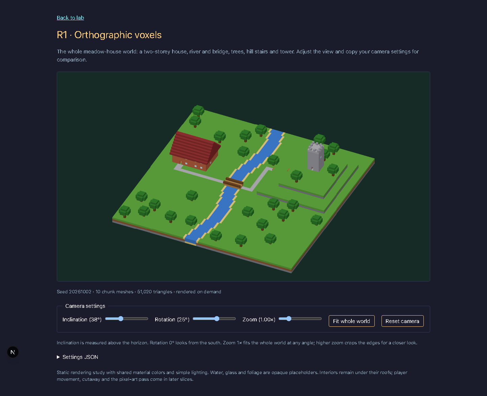
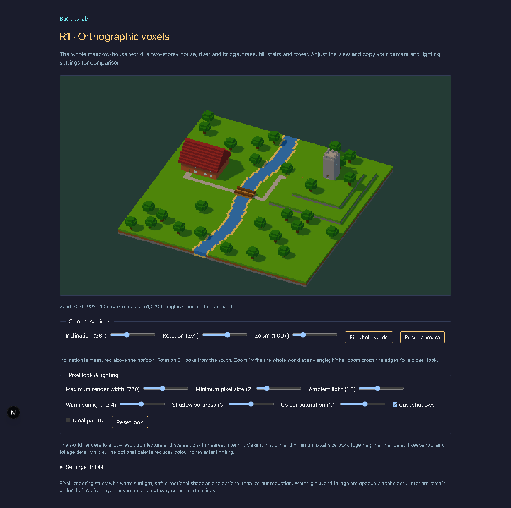
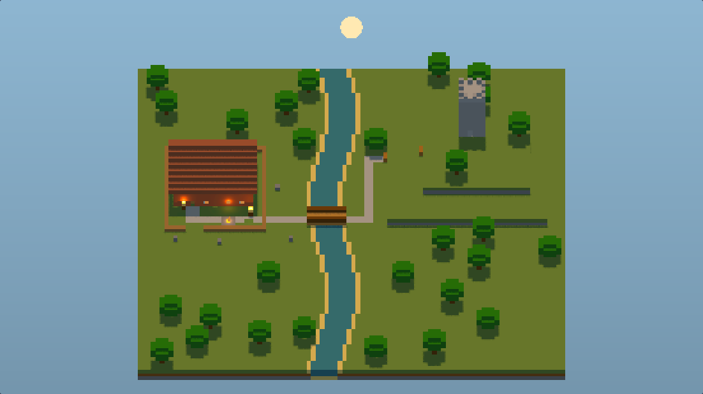
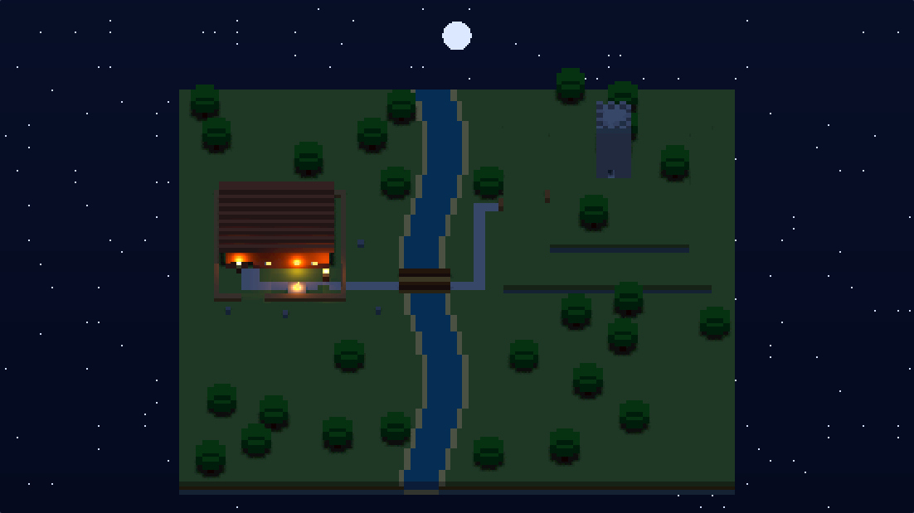
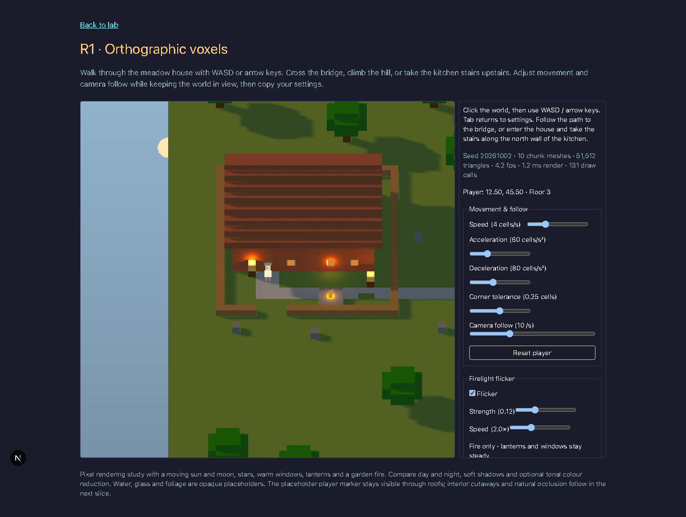

# R1.1 – Statische orthografische Testwelt

Route: `/lab/r1-voxel`, Bead: `evermore-1fo.3.1`.

Aufnahme: Chromium (headless), 1440 × 1080 Viewport, 02.10.2026.
Kamera: Neigung 38° über dem Horizont, Drehung 25° (0° = Blick aus Süden), Zoom 1×.
Welt: `meadow-house`, Seed `20261002`, 10 Chunk-Meshes, 51 020 Dreiecke.

Beim Vergleichen auf die Lesbarkeit von Haus, Brücke, Hügelkanten und Turm achten; die Grundansicht zeigt die ganze Welt und behält bei anderer Drehung/Neigung einen Rand. Die Dachstufen und Bäume sind bewusst reine Voxel mit Materialfarben und einfacher Beleuchtung. Für Detailansichten zoomen und die aktuellen Werte über «Settings JSON» kopieren; «Fit whole world» setzt nur Zoom auf 1× zurück.

Offene gestalterische Fragen für maw: Wirkt 38° ausreichend wie ein 2D-RPG oder sollte die Neigung flacher sein? Ist die leichte Drehung von 25° hilfreich oder passt ein gerader Südblick besser?

Diese Scheibe enthält keinen Spieler, keine Cutaways und keinen Pixel-Renderpass; Wasser, Glas und Laub sind deckende Platzhalter. Rendering erfolgt nur bei Initialisierung, Kameraänderung und Resize, daher gibt es hier noch keine Game-Loop-FPS-Messung.

Prüfung: Typecheck, Lint, vollständige Tests und Produktions-Build. Die sechs neuen Geometrie-/Kameratests prüfen äussere Flächenorientierung, Nähte über alle Chunk-Achsen, leere Randchunks und vollständige Kameraframing-Grenzen für Hoch-/Querformat und verschiedene Winkel.

## R1.2 – Pixel-Look und Licht

Bead: `evermore-1fo.3.2`. Aufnahme: Chromium (headless, Software-WebGL),
1440 × 1200 und 390 × 844 Viewport, 03.10.2026.

[Mobile Ansicht mit Reglern und JSON](screenshots/r1-voxel-pixel-mobile.png).

Die Welt rendert ohne Antialiasing in ein niedrig aufgelöstes Render-Target;
ein zweiter Pass skaliert mit Nearest-Filter und stellt Sättigung sowie optionale
tonale Farbreduktion ein. Die Auflösung folgt dem Viewport mit einem ganzzahligen
Skalierungsfaktor: maximal 720 Pixel Breite, mindestens 2 CSS-Pixel pro Renderpixel
als Startwerte (Desktop-Aufnahme: 552 × 310). Das bewahrt mehr Dach- und
Baumdetails als ein festes 480 × 270 Target, passend zu maws Feedback.
Alle Look- und Kamera-Werte sind zusammen als JSON kopierbar.

Warmes gerichtetes Sonnenlicht und kühles Umgebungslicht erzeugen die
Grundstimmung. Alle Chunk-Meshes werfen und empfangen Schatten; PCF-Filter,
2048² Schattenkarte und ein Weichheitsregler sorgen für weichere Kanten.
Render-Target, Bildschirmgeometrie, Material und Schattenkarte werden beim
Unmount freigegeben. Rendering bleibt ereignisgetrieben.

Worauf achten: Hausdach, Brücke und Baumkronen bleiben trotz Pixelraster lesbar;
die Schatten geben den Bäumen und dem Haus eine erkennbare Richtung und Tiefe.
Mit «Minimum pixel size» und «Maximum render width» feine und grobe Ansichten
vergleichen; die tonale Palette ist bewusst optional und standardmässig aus.
Die Art-Bible-Prüfung sieht konsistente Pixeldichte und wärmeres Licht; für ein
wirklich lebendiges, gemütliches Zuhause fehlen noch die angekündigten Details
der neuen Testwelt und lokale Lichtquellen.

Offene Fragen für maw: Ist die Start-Pixeldichte fein genug oder soll 1 CSS-Pixel
der Standard sein? Passt die warme Sonnenrichtung, und soll die optionale
Farbreduktion später durch eine bewusst gestaltete Biom-Palette ersetzt werden?

Validierung: Frozen install, Typecheck, Lint, vollständige Tests (40 www,
38 world, 5 core, 6 ESLint) und Produktions-Build grün. Browserprüfung:
keine Console-/Shaderfehler; Pixelgrösse, Palette, Schatten an/aus, Reset und
JSON-Export geprüft; Desktop und Mobil visuell geprüft. Node lokal 24.18 statt
Projektziel 22. ADE-Proof-Anhang scheitert an der lokalen CLI-Verbindung
(`sources.agentChatService.subscribeToEvents is not a function)); Screenshots
sind deshalb versioniert im Repo.

## R1.5 – Lichtquellen und Tag/Nacht

Bead: `evermore-1fo.3.5`. Aufnahme: Chromium mit Software-WebGL,
1440 × 1400 (Canvas 1104 × 621) und 390 × 844, 03.10.2026.

[Mobile Nachtansicht mit Reglern und JSON](screenshots/r1-light-night-mobile.png).

Der Regler läuft über 24 Stunden: Sonnenaufgang um 06:00, Sonnenuntergang um
18:00, abends wärmeres Sonnenlicht, nachts kühles Mondlicht und Sterne. Sonne
und Mond wandern auf gegenüberliegenden Bahnen; die Schattenrichtung und
-länge folgen den Richtungslichtern. Die Himmelskörper sind stilisierte,
bildschirmbezogene Pixel-Scheiben im Hintergrundpass, keine astronomische
Simulation. Der Himmel und seine Sterne verwenden dasselbe Pixelraster wie
die Welt.

Die Fixture-Begleitdaten liefern fünf lokale Quellen: Innenkamin, zwei
Laternen, Fensterlicht und eine neue Gartenfeuerstelle. PointLights mit
Distanzabfall und 512² Würfelschattenkarten erhellen die Umgebung; emissive
Voxel-Flächen machen Laternen, Fenster und Feuer selbst sichtbar. Das
Fensterlicht sitzt ausserhalb der Südwand, damit die unverändert deckenden
Glas-Voxel es nicht vollständig abschatten. Das Feuer im Garten zeigt den
dritten Quellentyp bereits in der Aussenansicht; der Innenkamin bleibt bis
zur Gebäude-Cutaway-Scheibe hinter dem Dach.

Alle Parameter sind gemeinsam mit Kamera und Pixel-Look als JSON kopierbar:
Tageszeit, Radius-Multiplikator, lokale Intensität, Farbtemperatur in Kelvin,
Mondlicht, Schatten/Weichheit und Zeitraffer-Geschwindigkeit. Lokales Licht
bleibt tagsüber eingeschaltet, wird aber auf 20 % reduziert. Zeitraffer ist
optional, standardmässig pausiert, auf zwölf Updates pro Sekunde begrenzt und
pausiert in versteckten Tabs. Sonst bleibt das Rendering ereignisgetrieben;
Unmount gibt auch lokale Materialien, Geometrien und Schattenkarten frei.

Worauf achten: Bei Nacht bilden Fenster, Laternen und Feuer eine warme Insel
gegen die kühle Umgebung; «Local lights» an/aus zeigt den tatsächlichen
Lichtkegel und die Schattenwirkung. Zwischen Morgen und Abend wechseln
Richtung und Länge der Baumschatten. Radius, Intensität, Temperatur und
Schattenweichheit verändern, wie weit und wie weich diese Insel wirkt.
Die Art-Bible-Prüfung sieht konsistente Pixeldichte, sichtbare lokale Quellen
und eine wärmere Zuhause-Stimmung; die gesamte Testwelt bleibt ein Diorama.

Offene Fragen für maw: Ist die Nacht hell genug zum Spielen, oder sollen
Mond/Umgebung heller werden? Ist der warme Lichtbereich ums Haus gross genug?
Passt der stilisierte Sternenhimmel um das Diorama, oder später lieber nur
ein abstrakter Hintergrund?

Browserprüfung: Regler für Radius, Intensität, Temperatur, Mondlicht und
Schattenweichheit sowie Licht/Schatten an/aus ändern nachweislich das
Canvas-Bild. JSON und echter Clipboard-Export, Zeitraffer/Pause und mobile
Ansicht ohne horizontalen Überlauf geprüft. Keine Shader-/JavaScript-Fehler;
die bestehende fehlende `/favicon.ico` liefert 404, Software-WebGL meldet beim
Screenshot gelegentlich ReadPixels-Stalls. ADE-Proof konnte wegen fehlender
Desktop-Bridge und nicht erlaubtem Worktree-Importpfad nicht registriert
werden; die Bilder sind deshalb als Repo-Artefakte versioniert.

Qualitätsprüfungen: Typecheck, Lint, vollständige Tests (50 www, 40 world,
5 core, 6 ESLint) und Produktions-Build ohne Turbo-Cache grün. Lokale
Node-Version 23.6.0 statt Projektziel 22; auch der vorhandene Pfad
`/opt/homebrew/opt/node@22/bin/node` meldet 23.6.0. Die finalen Screenshots und
Browserprüfungen stammen vom Produktions-Build.

## R1.3 – Spieler, Bewegung und Treppen

Bead: `evermore-1fo.3.3`. Die Startansicht ist der achsenparallele «2D look»
(45°, Rotation 0°), mit Zoom 2,2× und einer Kamera, die dem Spieler folgt.
Ins Weltbild klicken und WASD/Pfeiltasten verwenden; Tab oder ein Klick ins
Panel gibt die Tastatur frei und stoppt die Bewegung. «Reset player» setzt
Figur und Nachführung vor die Haustür zurück.

[Spieler im Obergeschoss (Floor 6)](screenshots/r1-player-upstairs.png),
[Mobilansicht](screenshots/r1-player-mobile.png),
[Zoom 0,5×](screenshots/r1-player-zoom-min.png) und
[Zoom 8×](screenshots/r1-player-zoom-max.png).

Das framework-freie Movement aus `packages/core` simuliert mit 60 Hz:
Subpixel-Positionen, normalisierte Diagonalen, Beschleunigung/Abbremsung,
Wandgleiten und Corner Correction. Der Voxel-Adapter prüft alle vom
Fuss-Rechteck berührten Zellen (Radius 0,22), begehbare Unterstützung innerhalb
von ±1 Höhenzelle und zwei Zellen gemeinsame Kopffreiheit. Die Fixture öffnet
deshalb die Decke auch über der Anlaufzelle vor der Küchentreppe. Wasser,
Wände, Möbel und Weltgrenzen bleiben Hindernisse; Dächer werden nicht als
Boden unter dem Spieler gewählt. Regler für Geschwindigkeit, Beschleunigung,
Abbremsung, Ecktoleranz und Kamera-Follow sind gemeinsam im kopierbaren JSON.

Der gemeinsame vierteilige Platzhalter wird als Nearest-gefiltertes Billboard
gezeichnet; nur seine Bildschirmposition wird auf Renderpixel gerundet.
Die Simulation bleibt präzise. Die Nachführung verwendet zeitunabhängige
exponentielle Dämpfung. Die Figur bleibt als Navigationsmarker vor der
Geometrie sichtbar: Im Haus liegt das Dach weiterhin darüber und die Figur
wirkt im Bild deshalb, als stünde sie darauf. Echte Cutaways und natürliche
Okklusion gehören zur folgenden Scheibe R1.4.

Das unabhängig scrollbare Panel steht neben dem Canvas und bleibt auch bei
390 Pixel Viewportbreite gleichzeitig sichtbar. Kamera-Presets erhalten den
gewählten Zoom. Der Bildschirm-Pass benutzt eine separate Kamera und wird
nicht nach Weltkoordinaten aussortiert; sonst verschwand er beim Follow/Zoom.
Bewegung, Lichtflackern und Zeitraffer teilen eine auf Unmount beendete Loop;
versteckte Tabs pausieren. Unveränderte Schattenkarten werden beim Laufen
wiederverwendet, idle Flackern bleibt auf 30 Render-Updates/s begrenzt.

Worauf achten: Erst durch die Haustür nach Norden, durch die Innentür im
Wohnzimmer nach Osten und in der Küche an der Nordwand die Treppe von Westen
nach Osten nehmen – «Floor» wechselt von 3 auf 6 und auf dem Rückweg wieder
zurück. Draussen führen der Weg, die Brücke und die Hügelstufen durch die Welt;
Wasser und die zweizelligen Klippen blockieren. Speed und Follow im Panel
ändern und die direkte Bewegung mit träger bzw. enger Nachführung vergleichen.

Art-Bible-Eindruck: Achsenparallele Perspektive, gemeinsames Pixelraster und
warme lokale Beleuchtung bleiben erhalten; der helle Platzhalter ist deutlich
lesbar. Die sichtbare Figur auf dem geschlossenen Dach ist bewusst noch keine
fertige Innenraumdarstellung. Offene Fragen für maw: Passen Tempo 4 Zellen/s,
Follow 10/s und Zoom 2,2×? Soll die Kamera künftig einen kleinen Vorlauf in
Blickrichtung bekommen?

Automatisierte Browserprüfung bei laufendem lokalen www-Server:
`node scripts/check-r1-player.mjs http://127.0.0.1:<BASE_PORT>`.
Sie prüft einen nicht leeren Renderpass, echte Tastaturbewegung durch die
Haustüren und Treppe in beide Richtungen, Fokusverlust, JSON/Clipboard,
Panel-Scroll ohne Überschneidung, Zoom-Grenzen, Zeitraffer, Idle-Flackern,
Mobilansicht ohne horizontalen Überlauf und JavaScript-/Shaderfehler.
Fünf Modelltests decken Fuss-AABB, Wasser/Wände/Grenzen, Wandgleiten, den
Hausweg, Brücke/Hügel, Kopffreiheit, kamerabezogene Eingabe und zeitunabhängige
Dämpfung ab. Screenshots headless aufgenommen und selbst angesehen.
Software-WebGL-FPS sind kein Nachweis für 60 fps auf Spieler-Hardware.

Abschlussprüfungen: `pnpm install`, Typecheck, Lint, vollständige Tests
(98 www, 55 world, 13 core plus bestehende ESLint-/Script-Tests) und
Produktions-Build grün. Lokale Node-Version 23.6.0 statt Projektziel 22;
die vorhandene Engine-Warnung hat die Checks nicht verhindert.

## R1.14 – Spieler in der Welt: Tiefe, Kollision und Schatten

Bead: `evermore-1fo.3.14`. Die Figur ist ein kameraorientiertes Mesh mit
Alpha-Test, Depth-Test und Depth-Write an der echten Fussposition. Auch die
Top-down-Kamera erhält ein sichtbares Billboard. Deckende Wände, Dächer und
Baumkronen verdecken die Figur tatsächlich; Cutaways bleiben bei R1.4.
Ein unsichtbarer Körper mit Fussradius 0,22 und Höhe 2 wirft Schatten für
Sonne, Mond und PointLights unabhängig vom Kamerawinkel. Bewegung invalidiert
die sonst gecachten Schattenkarten, damit der Schatten der Figur folgt.

Der Voxel-Adapter blockiert Laub im Körperraum. Aufstiege benötigen eine
Treppenstufe oder einen Brückenübergang und bleiben auf eine Höhenzelle
begrenzt; die Küchentreppe und beide Hügelstufen funktionieren in beide
Richtungen. Ungültige Spawns und überlappende Zustände werden auf die nächste
freie Fussposition verschoben. Gemeinsame Corner Correction prüft den ganzen
seitlichen Weg und beendet den Vorwärtsschritt auch bei diagonaler Eingabe,
damit die Gegenrichtung den Spieler nicht am Eck hin und her schiebt.

Headless-Aufnahmen (Chromium, 1440 × 1000, Zoom 4×):
[vor dem Haus am Tag](screenshots/r1-depth/house-front-day.png),
[bei Nacht](screenshots/r1-depth/house-front-night.png),
[im Haus am Tag](screenshots/r1-depth/house-inside-day.png),
[bei Nacht](screenshots/r1-depth/house-inside-night.png),
[hinter dem Baum am Tag](screenshots/r1-depth/tree-behind-day.png),
[bei Nacht](screenshots/r1-depth/tree-behind-night.png),
[im Turm am Tag](screenshots/r1-depth/tower-inside-day.png) und
[bei Nacht](screenshots/r1-depth/tower-inside-night.png).
Die verschwundene Figur in den Innenaufnahmen ist der erwartete Tiefentest;
der Turmeingang lässt die Füsse korrekt durch die offene Tür sehen.

Browserprüfung: `node scripts/check-r1-depth.mjs http://127.0.0.1:<port>`.
Der Test identifiziert den Spieler-Draw an seiner Textur und vergleicht die
Framebuffer-Pixel mit unterdrücktem Draw: Vor dem Haus ändert die Figur das
Bild, im Haus, hinter dem Baum und hinter einer massiven Turmwand nicht.
Ein separater Vergleich unterdrückt nur den Schattenkörper: Sonne, Mond und
lokales Licht verlieren jeweils dessen messbaren Schattenbeitrag.
Der Test läuft mit echten Tasten über Garten, Brücke und Hügel ins Turminnere.
Unit-Tests prüfen zusätzlich 50 reproduzierbare zufällige Laufwege, gültige
Fuss-AABBs, maximale Schritthöhe, Spawn-Recovery und diagonale Ecken.

ADE-Proof-Registrierung ist lokal nicht verfügbar (`ade: command not found`);
die Aufnahmen bleiben deshalb versionierte Repository-Artefakte. Die lokale
Node-Version 23.6.0 weicht vom Projektziel 22 ab; Software-WebGL-Messungen sind
kein Nachweis für die Bildrate auf Spieler-Hardware.

Abschlussprüfungen: `pnpm install`, Typecheck, Lint, vollständige Tests
(290 www, 81 world, 14 core sowie ESLint-/Script-Tests; ein bestehender
Integrationstest übersprungen) und Produktions-Build grün. Die finalen acht
Aufnahmen und alle Pixel-/Schattenvergleiche stammen vom Produktions-Build.
